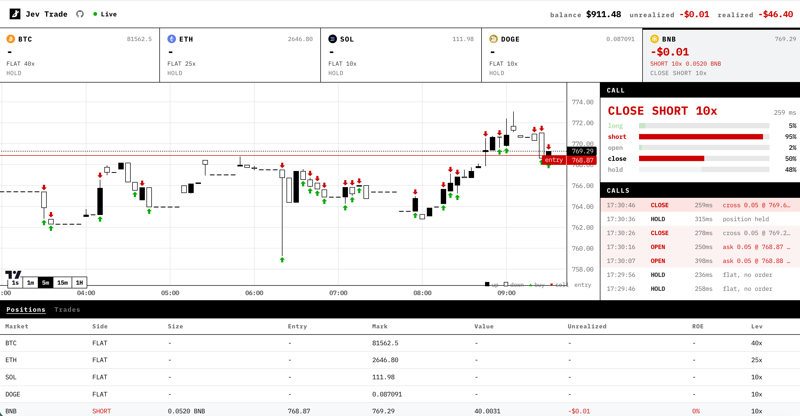

# Jev Trade

[](https://www.jev-trade.com/)
[](LICENSE)

I built a trading bot with Jev. Jev reads the Hyperliquid book every tick and answers buy, sell, or hold. The bot sends the order. Five coins, five wallets, real fills.

**[Watch the live desk](https://www.jev-trade.com/)**

[](https://www.jev-trade.com/)

Jev makes the call. Hold is one of its answers, so a tick can end with no order. Position, balance, and PnL come from Hyperliquid.

Based on [jev-trader](https://github.com/jarrodwatts/jev-trader) by Jarrod Watts (MIT). Venue is Hyperliquid, not Monad / Kuru.

## What you are looking at

- Five isolated sleeves: BTC, ETH, SOL, DOGE, BNB. Each has its own wallet and its own Jev call.
- The left pane is the live book as candles. Green and red marks are fills. The entry line is the open position.
- The right pane is the latest Jev call and the tape of every tick.
- The table is Positions and Trades, the same split a futures desk uses.

A live key on testnet or mainnet sends real orders. Start with a dry run.

## How a tick works

1. The bot reads the book.
2. Jev picks long or short, then open, close, or hold.
3. An entry is a post-only Alo quote one tick inside the touch, so it sits on the maker side until a taker hits it.
4. An exit is an Ioc that crosses the touch and fills on the spot.
5. Hold sends no order and pulls any resting quote Jev no longer wants.

The bot is Bun on port 3000. The dashboard is Next in `web/` on port 3001. Keys, evaluate, and orders stay on the Bun process.

## Dry run

[Bun](https://bun.sh) 1.2 or newer. No `PRIVATE_KEY` means a dry run: real book, real decisions, simulated fills. Default `MODEL=mock` is a momentum stand-in and needs no API key.

```sh
cp .env.example .env
bun install
bun run start
```

Dashboard (second terminal):

```sh
cp web/.env.example web/.env.local
bun run dev:web
```

Open http://localhost:3001. The page reads `$NEXT_PUBLIC_API_URL/events` (default `http://localhost:3000`).

## Live Jev

Set `MODEL=jev` and pick an API. Official TypeSafe is the default.

```sh
MODEL=jev
JEV_PROVIDER=typesafe
TYPESAFE_API_KEY=
# JEV_MODEL_ID defaults to jev-latest
```

Get a key from [docs.typesafe.ai](https://docs.typesafe.ai/).

Vercel AI Gateway is still supported:

```sh
MODEL=jev
JEV_PROVIDER=gateway
AI_GATEWAY_API_KEY=
# JEV_MODEL_ID defaults to typesafe-ai/jev
```

If `JEV_PROVIDER` is unset, the bot uses TypeSafe when `TYPESAFE_API_KEY` is set, otherwise Gateway when `AI_GATEWAY_API_KEY` is set.

## Live testnet orders

1. Keep `HL_TESTNET=true`.
2. Set `PRIVATE_KEY` for the first coin (BTC).
3. Copy `.wallets.example.json` to `.wallets.json` and put a key on each other sleeve. Or set `WALLETS_JSON`.
4. Get mock USDC from https://app.hyperliquid-testnet.xyz/drip. The faucet only pays addresses that have deposited on mainnet.
5. Leave `DRY_RUN=false`. A missing key on a sleeve still dry-runs that sleeve.

`HL_TESTNET=false` is mainnet. Do not flip that until you mean it.

## Tests

```sh
bun test
```

CI runs the same command on push and pull request.

## Env

See [`.env.example`](.env.example). The ones that change behavior:

| Variable | Default | Meaning |
| --- | --- | --- |
| `HL_COINS` | `BTC,ETH,SOL,DOGE,BNB` | Sleeves to run |
| `HL_TESTNET` | `true` | `false` is mainnet |
| `MODEL` | `mock` | `jev` needs a TypeSafe or Gateway key |
| `JEV_PROVIDER` | `typesafe` | `typesafe` or `gateway` |
| `TYPESAFE_API_KEY` | empty | Official TypeSafe key |
| `AI_GATEWAY_API_KEY` | empty | Vercel AI Gateway key |
| `PRIVATE_KEY` | empty | First coin. Empty is a dry run |
| `DRY_RUN` | `false` | `true` simulates every sleeve |
| `TICK_MS` | `2000` | Decision + requote cadence |
| `PRICE_MS` | `200` | Chart and mid prints. Does not call Jev |
| `QUOTE_USD` | `40` | Quote notional per tick |
| `CLOSE_SLIPPAGE_BPS` | `5` | How far an exit crosses the touch |
| `PORT` | `3000` | Bot SSE |

## Endpoints

- `GET /` snapshot: model, sleeves, latestByCoin
- `GET /history` last 1000 ticks per coin
- `GET /tape` all-time mid series plus fill marks per coin
- `GET /events` SSE: `snapshot` on connect (`historyByCoin`, `tapeByCoin`), then `block`, `quote`, `fill` keyed by coin

## Layout

```
src/           Bun bot
test/          bun tests
web/           Next dashboard
assets/        README shots of the live desk
```

## License

MIT. Copyright 2026 aowang. Includes MIT code originally published as jev-trader by Jarrod Watts.
